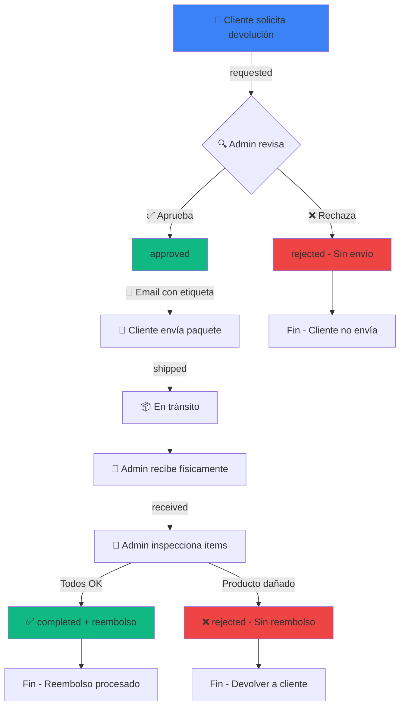

# 📦 Flujo de Devoluciones - FashionStore

## 🎯 Lógica de Negocio

### Flujo Correcto (Aprobación Preliminar)



## 📊 Estados de Devolución

| Estado | Descripción | Quién actúa | Siguiente paso |
|--------|-------------|-------------|----------------|
| **requested** | Solicitud enviada por cliente | Admin revisa | → approved o rejected |
| **approved** | Pre-aprobado por admin | Cliente envía | → shipped |
| **shipped** | Paquete enviado por cliente | Nadie (en tránsito) | → received |
| **received** | Paquete recibido en almacén | Admin inspecciona | → completed o rejected |
| **completed** | Inspección OK + Reembolso procesado | - | FIN ✅ |
| **rejected** | Rechazado (sin envío O sin reembolso) | - | FIN ❌ |

## 🔄 Transiciones Válidas

```
requested → approved   (Admin: "Sí, procede la devolución")
requested → rejected   (Admin: "No, motivo inválido")

approved → shipped     (Cliente: "Ya lo envié")
approved → rejected    (Admin: "Cancelar antes de envío")

shipped → received     (Admin: "Llegó el paquete")

received → completed   (Admin: "Producto OK, reembolsar")
received → rejected    (Admin: "Producto dañado, no reembolsar")
```

## 🚫 Transiciones Inválidas

- ❌ `requested → received` (NO se puede recibir sin aprobar primero)
- ❌ `requested → shipped` (Cliente NO puede enviar sin aprobación)
- ❌ `shipped → completed` (Debe pasar por received e inspección)
- ❌ `approved → completed` (Debe pasar por shipped y received)

## 💡 Ventajas de este Flujo

### ✅ Para la Tienda
- **Control previo**: Admin valida motivos antes de autorizar envío
- **Protección anti-fraude**: Inspección física antes de reembolsar
- **Sin costos innecesarios**: No se genera etiqueta si no procede
- **Stock controlado**: Solo se restock si producto está en buen estado

### ✅ Para el Cliente
- **Claridad**: Sabe si su devolución procede antes de enviar
- **Etiqueta incluida**: Recibe etiqueta de devolución con la aprobación
- **Seguimiento**: Visibilidad total del proceso
- **Transparencia**: Notificaciones por email en cada paso

## 📧 Emails Enviados

| Acción | Trigger | Contenido |
|--------|---------|-----------|
| Confirmación | Cliente solicita | "Hemos recibido tu solicitud" |
| Aprobación | Admin aprueba | "✅ Aprobada + instrucciones + etiqueta" |
| Rechazo inicial | Admin rechaza requested | "❌ No procede (motivo)" |
| Recibido | Admin marca received | "Recibimos tu paquete, inspeccionando..." |
| Completado | Admin completa | "✅ Reembolso procesado: X€" |
| Rechazo final | Admin rechaza received | "❌ Producto dañado, no se reembolsa" |

## 🔐 Permisos y Seguridad

### Admin puede:
- ✅ Ver todas las devoluciones
- ✅ Aprobar/rechazar solicitudes (requested)
- ✅ Marcar como recibido (shipped → received)
- ✅ Inspeccionar items individualmente
- ✅ Completar con reembolso (received → completed)
- ✅ Rechazar post-inspección (received → rejected)

### Cliente puede:
- ✅ Ver solo sus devoluciones
- ✅ Solicitar devolución (→ requested)
- ✅ Marcar como enviado si aprobado (approved → shipped)
- ✅ Ver etiqueta de devolución si aprobado

### Cliente NO puede:
- ❌ Cambiar estado a received
- ❌ Marcar como shipped sin aprobación previa
- ❌ Modificar inspection_status de items
- ❌ Ver devoluciones de otros clientes

## 🔍 Inspección de Items

Una vez en estado `received`, admin inspecciona cada item:

```sql
inspection_status:
  - pending   (sin revisar)
  - approved  (OK para restock y reembolso)
  - rejected  (dañado, no se reembolsa)
```

**Cálculo de reembolso:**
```
refund_amount = SUM(item.price * item.quantity) 
                WHERE inspection_status = 'approved'
```

**Restauración de stock:**
```
Solo se incrementa stock de items con:
  inspection_status = 'approved' AND restock_approved = true
```

## 📝 Ejemplo Completo

### Caso: Cliente devuelve 2 artículos de un pedido

1. **Cliente solicita** (via web)
   - Item A: Talla equivocada
   - Item B: Color no coincide
   - Estado: `requested`

2. **Admin revisa** (panel admin)
   - ✅ Motivos válidos, dentro de plazo
   - Clic en "Aprobar"
   - Estado: `approved`
   - 📧 Email con etiqueta enviado

3. **Cliente envía** (via web o correos)
   - Descarga etiqueta, empaqueta, envía
   - Marca como "Enviado" + tracking
   - Estado: `shipped`

4. **Paquete llega** (almacén)
   - Admin marca "Recibido"
   - Estado: `received`
   - 📧 Email "Recibimos tu paquete"

5. **Admin inspecciona** (panel admin)
   - Item A: ✅ Perfecto estado → approved + restock
   - Item B: ❌ Manchado por cliente → rejected
   - Clic en "Completar"
   - Reembolso: Solo Item A

6. **Sistema procesa** (automático)
   - Estado: `completed`
   - Stripe refund: Monto de Item A
   - Stock: +1 Item A
   - 📧 Email "Reembolsado X€"

---

## 🚀 Implementación Técnica

### Base de Datos
- Tabla `returns` con estados validados
- Tabla `return_items` con inspection_status
- Trigger de auditoría automático
- Vista `return_statistics` para métricas

### APIs
- `POST /api/returns` - Cliente solicita
- `PUT /api/admin/returns` - Admin procesa (approve/reject/receive/complete)
- `PUT /api/returns/:id/mark-shipped` - Cliente marca enviado
- `PATCH /api/admin/returns` - Admin inspecciona item

### Emails
- Template aprobación (con instrucciones)
- Template recepción
- Template completado (con monto)
- Template rechazo (inicial o final)

### Componentes
- `ReturnTimeline` - Progreso visual
- `OrderActions` - Solicitar/enviar devolución
- Admin views - Gestión completa

---

**Última actualización:** 2026-01-23  
**Versión:** 2.0 - Flujo corregido con aprobación preliminar
