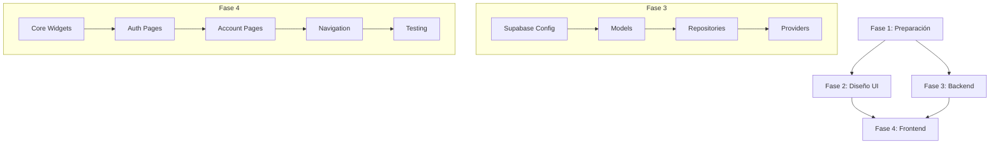

# 🗺️ Plan de Implementación: Autenticación y Perfiles

## Información General

| Aspecto | Detalle |
|---------|---------|
| **Módulo** | auth-profiles |
| **Duración Estimada** | 5-7 días |
| **Desarrollador** | - |
| **Estado** | 📋 Planificado |

---

## Resumen de Fases

| Fase | Nombre | Duración | Dependencias |
|------|--------|----------|--------------|
| 1 | Análisis y Preparación | 1 día | Ninguna |
| 2 | Diseño UI | 1-2 días | Fase 1 |
| 3 | Implementación Backend | 1-2 días | Fase 1 |
| 4 | Implementación Frontend | 2-3 días | Fases 2 y 3 |

---

## Fase 1: Análisis y Preparación

### Entregables

- [ ] Documento de análisis completo (`analisis.md`)
- [ ] Lista de packages Flutter necesarios
- [ ] Estructura de carpetas definida
- [ ] Configuración inicial del proyecto Flutter

### Estructura de Carpetas Propuesta

```
lib/
├── main.dart
├── app.dart
├── core/
│   ├── config/
│   │   ├── app_config.dart
│   │   ├── supabase_config.dart
│   │   └── routes.dart
│   ├── theme/
│   │   ├── app_theme.dart
│   │   ├── colors.dart
│   │   ├── typography.dart
│   │   └── spacing.dart
│   ├── utils/
│   │   ├── validators.dart
│   │   ├── formatters.dart
│   │   └── extensions.dart
│   └── widgets/
│       ├── buttons/
│       ├── inputs/
│       ├── cards/
│       └── loading/
├── features/
│   └── auth/
│       ├── data/
│       │   ├── models/
│       │   │   ├── user_model.dart
│       │   │   └── profile_model.dart
│       │   ├── repositories/
│       │   │   └── auth_repository.dart
│       │   └── datasources/
│       │       └── auth_remote_datasource.dart
│       ├── domain/
│       │   ├── entities/
│       │   │   ├── user.dart
│       │   │   └── profile.dart
│       │   ├── repositories/
│       │   │   └── auth_repository_interface.dart
│       │   └── usecases/
│       │       ├── login_usecase.dart
│       │       ├── register_usecase.dart
│       │       ├── logout_usecase.dart
│       │       ├── reset_password_usecase.dart
│       │       └── update_profile_usecase.dart
│       └── presentation/
│           ├── providers/
│           │   ├── auth_provider.dart
│           │   └── profile_provider.dart
│           ├── pages/
│           │   ├── login_page.dart
│           │   ├── register_page.dart
│           │   ├── forgot_password_page.dart
│           │   ├── reset_password_page.dart
│           │   ├── account_page.dart
│           │   └── edit_profile_page.dart
│           └── widgets/
│               ├── auth_form.dart
│               ├── profile_form.dart
│               ├── user_avatar.dart
│               └── user_menu.dart
└── shared/
    ├── services/
    │   ├── storage_service.dart
    │   └── navigation_service.dart
    └── providers/
        └── app_providers.dart
```

### Packages Requeridos

```yaml
dependencies:
  flutter:
    sdk: flutter
    
  # Supabase
  supabase_flutter: ^2.3.0
  
  # Estado
  flutter_riverpod: ^2.4.9
  riverpod_annotation: ^2.3.3
  
  # Navegación
  go_router: ^13.0.0
  
  # UI
  flutter_svg: ^2.0.9
  cached_network_image: ^3.3.1
  shimmer: ^3.0.0
  
  # Formularios
  flutter_form_builder: ^9.1.1
  form_builder_validators: ^9.1.0
  
  # Almacenamiento seguro
  flutter_secure_storage: ^9.0.0
  
  # Utilidades
  intl: ^0.18.1
  equatable: ^2.0.5
  dartz: ^0.10.1

dev_dependencies:
  flutter_test:
    sdk: flutter
  riverpod_generator: ^2.3.9
  build_runner: ^2.4.8
  flutter_lints: ^3.0.1
  mockito: ^5.4.4
```

---

## Fase 2: Diseño UI

### Entregables

- [ ] Sistema de temas Flutter
- [ ] Componentes reutilizables
- [ ] Wireframes/Mockups de pantallas
- [ ] Guía de estilos

### Pantallas a Diseñar

| Pantalla | Prioridad | Componentes Clave |
|----------|-----------|-------------------|
| Login | 🔴 Alta | AuthForm, SocialButtons |
| Registro | 🔴 Alta | AuthForm extended |
| Recuperar contraseña | 🟡 Media | EmailForm |
| Nueva contraseña | 🟡 Media | PasswordForm |
| Mi cuenta (Dashboard) | 🔴 Alta | UserInfo, RecentOrders |
| Editar perfil | 🔴 Alta | ProfileForm, AddressForm |

### Sistema de Temas

```dart
// Mapeo de colores web → Flutter
// Light Mode
primary: Color(0xFF588C00)     // hsl(84, 85%, 35%)
primaryForeground: Colors.white
background: Colors.white
foreground: Color(0xFF09090B)
accent: Color(0xFFFF4757)

// Dark Mode  
primary: Color(0xFFCCFF00)     // hsl(84, 100%, 50%)
primaryForeground: Color(0xFF09090B)
background: Color(0xFF09090B)
foreground: Color(0xFFFAFAFA)
```

---

## Fase 3: Implementación Backend

### Entregables

- [ ] Configuración Supabase Flutter
- [ ] Modelos de datos
- [ ] Repositorios implementados
- [ ] Servicios de autenticación
- [ ] Manejo de errores

### Tareas Detalladas

| Tarea | Prioridad | Estimación |
|-------|-----------|------------|
| Configurar Supabase client | 🔴 Alta | 2h |
| Crear UserModel y ProfileModel | 🔴 Alta | 1h |
| Implementar AuthRepository | 🔴 Alta | 4h |
| Implementar ProfileRepository | 🔴 Alta | 2h |
| Crear AuthProvider con Riverpod | 🔴 Alta | 3h |
| Implementar secure storage para tokens | 🔴 Alta | 2h |
| Configurar deep links para password reset | 🟡 Media | 2h |
| Tests unitarios de repositorios | 🟡 Media | 3h |

### Integración Supabase

```dart
// Funciones a implementar
- signInWithEmail(email, password)
- signUp(email, password, metadata)
- signOut()
- resetPasswordForEmail(email)
- updateUser(password)
- getProfile()
- updateProfile(profileData)
- onAuthStateChange listener
```

---

## Fase 4: Implementación Frontend

### Entregables

- [ ] Todas las pantallas implementadas
- [ ] Navegación configurada
- [ ] Estados de loading/error
- [ ] Validaciones de formularios
- [ ] Tests de widgets

### Orden de Implementación

1. **Core Widgets** (1 día)
   - [ ] AppTextField
   - [ ] AppButton
   - [ ] AppCard
   - [ ] LoadingOverlay
   - [ ] MessageBanner

2. **Auth Pages** (1 día)
   - [ ] LoginPage
   - [ ] RegisterPage
   - [ ] ForgotPasswordPage
   - [ ] ResetPasswordPage

3. **Account Pages** (1 día)
   - [ ] AccountPage (Dashboard)
   - [ ] EditProfilePage
   - [ ] UserMenu widget

4. **Navegación y Guards** (0.5 días)
   - [ ] Configurar GoRouter
   - [ ] AuthGuard para rutas protegidas
   - [ ] Redirect logic

5. **Testing y Polish** (0.5 días)
   - [ ] Tests de widgets
   - [ ] Tests de integración
   - [ ] Ajustes visuales

---

## Dependencias entre Tareas



---

## Criterios de Aceptación

### Funcionales

- [ ] Usuario puede registrarse con email y contraseña
- [ ] Usuario puede iniciar sesión
- [ ] Usuario puede cerrar sesión
- [ ] Usuario puede recuperar contraseña via email
- [ ] Usuario puede establecer nueva contraseña
- [ ] Usuario puede ver su información de cuenta
- [ ] Usuario puede editar su perfil
- [ ] Usuario puede ver sus pedidos recientes
- [ ] Sesión persiste al cerrar/abrir app
- [ ] Rutas protegidas redirigen a login

### No Funcionales

- [ ] Tiempo de login < 2 segundos
- [ ] Formularios validan en tiempo real
- [ ] UI responde sin lag a interacciones
- [ ] Errores muestran mensajes claros en español
- [ ] Dark/Light mode funcionan correctamente
- [ ] Accesibilidad básica (labels, contraste)

---

## Riesgos y Mitigaciones

| Riesgo | Probabilidad | Impacto | Mitigación |
|--------|--------------|---------|------------|
| Deep links no funcionan en iOS | Media | Alto | Configurar URL schemes correctamente |
| Token refresh falla | Baja | Alto | Implementar retry logic |
| UI difiere mucho de web | Media | Medio | Usar sistema de diseño consistente |
| Performance en listas | Baja | Medio | Usar ListView.builder |

---

## Notas Adicionales

### Mejoras sobre la versión Web

1. **Biometría**: Añadir login con Face ID / Touch ID
2. **Remember Me**: Opción de mantener sesión
3. **Offline Mode**: Cache local del perfil
4. **Push Notifications**: Para verificación de email

### Consideraciones de Plataforma

- **iOS**: Configurar Info.plist para deep links
- **Android**: Configurar AndroidManifest para intent filters
- **Web (Flutter Web)**: Considerar para futuro

---

## Checklist de Revisión Final

- [ ] Código sigue arquitectura limpia
- [ ] No hay código duplicado
- [ ] Todos los textos están en español
- [ ] Colores y tipografías coinciden con web
- [ ] Formularios tienen validación
- [ ] Errores están manejados
- [ ] Loading states implementados
- [ ] Tests pasan
- [ ] README del módulo actualizado
