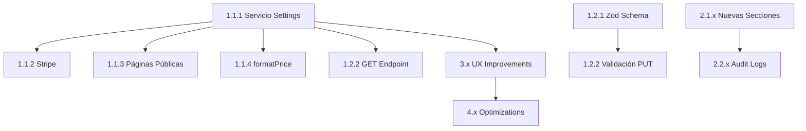

# 🚀 Plan de Implementación - Módulo de Configuración

**Proyecto:** FashionStore  
**Fecha:** 20 de enero de 2026  
**Duración estimada:** 4-5 sprints (8-10 semanas)

---

## 📋 Resumen de Fases

| Fase | Descripción | Duración | Prioridad |
|------|-------------|----------|-----------|
| **Fase 1** | Correcciones Críticas | 1-2 sprints | 🔴 Urgente |
| **Fase 2** | Mejoras Funcionales | 1-2 sprints | 🟠 Alta |
| **Fase 3** | UX/UI para No Técnicos | 1 sprint | 🟡 Media |
| **Fase 4** | Optimizaciones y Refinamientos | 0.5-1 sprint | 🟢 Baja |

---

## 🔴 FASE 1: Correcciones Críticas (Bugs que rompen funcionalidad)

**Objetivo:** Hacer que las configuraciones existentes funcionen realmente.  
**Duración:** 1-2 sprints  
**Prioridad:** URGENTE

### Sprint 1.1 - Conexión de Configuraciones con Sistema

#### Tarea 1.1.1: Crear Servicio Centralizado de Settings
**Esfuerzo:** Alto (8-12h)

```typescript
// src/lib/settings.ts
import { supabase } from './supabase';

// Cache en memoria (invalidar al guardar)
let settingsCache: Map<string, any> | null = null;
let cacheTimestamp: number = 0;
const CACHE_TTL = 60 * 1000; // 1 minuto

export interface StoreSettings {
  // Tienda
  storeName: string;
  storeEmail: string;
  storePhone: string;
  storeAddress: string;
  
  // Envío
  shippingCost: number;
  freeShippingThreshold: number;
  
  // Ofertas
  offersEnabled: boolean;
  flashOffersEnd: string | null;
  
  // Devoluciones
  returnWindowDays: number;
  
  // Moneda
  currency: string;
  locale: string;
  
  // Social
  socialInstagram: string;
  socialTwitter: string;
  socialTiktok: string;
  socialYoutube: string;
}

const DEFAULTS: StoreSettings = {
  storeName: 'FashionStore',
  storeEmail: 'contacto@fashionstore.com',
  storePhone: '+34 600 000 000',
  storeAddress: 'Calle Moda, 123, 28001 Madrid',
  shippingCost: 4.99,
  freeShippingThreshold: 50,
  offersEnabled: false,
  flashOffersEnd: null,
  returnWindowDays: 30,
  currency: 'EUR',
  locale: 'es-ES',
  socialInstagram: '',
  socialTwitter: '',
  socialTiktok: '',
  socialYoutube: '',
};

export async function getSettings(): Promise<StoreSettings> {
  const now = Date.now();
  
  // Usar caché si es válido
  if (settingsCache && (now - cacheTimestamp) < CACHE_TTL) {
    return mapSettingsFromCache(settingsCache);
  }
  
  // Fetch de BD
  const { data, error } = await supabase
    .from('settings')
    .select('key, value, value_bool, value_number');
  
  if (error || !data) {
    console.error('Error fetching settings:', error);
    return DEFAULTS;
  }
  
  // Actualizar caché
  settingsCache = new Map(data.map(s => [s.key, s]));
  cacheTimestamp = now;
  
  return mapSettingsFromCache(settingsCache);
}

function mapSettingsFromCache(cache: Map<string, any>): StoreSettings {
  return {
    storeName: cache.get('store_name')?.value ?? DEFAULTS.storeName,
    storeEmail: cache.get('store_email')?.value ?? DEFAULTS.storeEmail,
    storePhone: cache.get('store_phone')?.value ?? DEFAULTS.storePhone,
    storeAddress: cache.get('store_address')?.value ?? DEFAULTS.storeAddress,
    shippingCost: cache.get('shipping_cost')?.value_number ?? DEFAULTS.shippingCost,
    freeShippingThreshold: cache.get('free_shipping_threshold')?.value_number ?? DEFAULTS.freeShippingThreshold,
    offersEnabled: cache.get('offers_enabled')?.value_bool ?? DEFAULTS.offersEnabled,
    flashOffersEnd: cache.get('flash_offers_end')?.value ?? null,
    returnWindowDays: cache.get('return_window_days')?.value_number ?? DEFAULTS.returnWindowDays,
    currency: cache.get('currency')?.value ?? DEFAULTS.currency,
    locale: cache.get('locale')?.value ?? DEFAULTS.locale,
    socialInstagram: cache.get('social_instagram')?.value ?? '',
    socialTwitter: cache.get('social_twitter')?.value ?? '',
    socialTiktok: cache.get('social_tiktok')?.value ?? '',
    socialYoutube: cache.get('social_youtube')?.value ?? '',
  };
}

export function invalidateSettingsCache(): void {
  settingsCache = null;
  cacheTimestamp = 0;
}
```

**Archivos a modificar:**
- Crear: `src/lib/settings.ts`

---

#### Tarea 1.1.2: Usar Settings en Checkout/Stripe
**Esfuerzo:** Medio (4-6h)

```typescript
// src/lib/stripe.ts - ANTES
export const FREE_SHIPPING_THRESHOLD = 50;  // ❌ Hardcodeado
export const SHIPPING_COST = 499;           // ❌ Hardcodeado

// src/lib/stripe.ts - DESPUÉS
import { getSettings } from './settings';

// Eliminar constantes hardcodeadas
export async function getShippingConfig() {
  const settings = await getSettings();
  return {
    freeShippingThreshold: settings.freeShippingThreshold,
    shippingCost: Math.round(settings.shippingCost * 100), // Convertir a centavos
  };
}
```

```typescript
// src/pages/api/checkout/create-session.ts - ANTES
import { FREE_SHIPPING_THRESHOLD, SHIPPING_COST } from '@/lib/stripe';
const shippingCents = subtotalCents >= FREE_SHIPPING_THRESHOLD * 100 ? 0 : SHIPPING_COST;

// DESPUÉS
import { getShippingConfig } from '@/lib/stripe';
const { freeShippingThreshold, shippingCost } = await getShippingConfig();
const shippingCents = subtotalCents >= freeShippingThreshold * 100 ? 0 : shippingCost;
```

**Archivos a modificar:**
- `src/lib/stripe.ts`
- `src/pages/api/checkout/create-session.ts`

---

#### Tarea 1.1.3: Inyectar Settings en Páginas Públicas
**Esfuerzo:** Alto (6-8h)

```astro
---
// src/pages/contacto.astro - DESPUÉS
import PublicLayout from "@/layouts/PublicLayout.astro";
import { getSettings } from "@/lib/settings";

const settings = await getSettings();
---

<PublicLayout title="Contacto | {settings.storeName}">
  <!-- Email -->
  <p class="text-primary">{settings.storeEmail}</p>
  <!-- Teléfono -->
  <p class="text-primary">{settings.storePhone}</p>
  <!-- Dirección -->
  <p class="text-muted-foreground">{settings.storeAddress}</p>
</PublicLayout>
```

**Archivos a modificar:**
- `src/pages/contacto.astro`
- `src/pages/privacidad.astro`
- `src/pages/terminos.astro`
- `src/pages/envios.astro`
- `src/pages/index.astro` (sección de garantías)

---

#### Tarea 1.1.4: Crear Función formatPrice Centralizada
**Esfuerzo:** Alto (6-8h)

```typescript
// src/lib/formatters.ts - ACTUALIZADO
import { getSettings } from './settings';

// Versión síncrona para uso en templates (usa cache o default)
let cachedLocale = 'es-ES';
let cachedCurrency = 'EUR';

export function formatPrice(price: number): string {
  return new Intl.NumberFormat(cachedLocale, {
    style: 'currency',
    currency: cachedCurrency,
  }).format(price);
}

// Actualizar cache cuando cambian settings
export async function refreshFormatters(): Promise<void> {
  const settings = await getSettings();
  cachedLocale = settings.locale;
  cachedCurrency = settings.currency;
}

// Inicializar al cargar módulo
refreshFormatters().catch(console.error);
```

**Archivos a modificar:**
- `src/lib/formatters.ts`
- Eliminar funciones `formatPrice` duplicadas de:
  - `src/pages/index.astro`
  - `src/pages/carrito.astro`
  - `src/pages/productos/[slug].astro`
  - `src/pages/cuenta/*.astro`
  - `src/lib/email-templates.ts`
  - Y todos los demás archivos

---

### Sprint 1.2 - Validación y Seguridad

#### Tarea 1.2.1: Implementar Validación Backend con Zod
**Esfuerzo:** Alto (8-10h)

```typescript
// src/lib/validations/settings.ts
import { z } from 'zod';

export const settingsSchema = z.object({
  settings: z.array(z.union([
    // Setting booleano
    z.object({
      key: z.enum(['offers_enabled', 'maintenance_mode']),
      value_bool: z.boolean(),
    }),
    // Setting numérico
    z.object({
      key: z.enum(['shipping_cost', 'free_shipping_threshold', 'tax_rate', 'return_window_days']),
      value_number: z.number().min(0),
    }),
    // Setting texto (email)
    z.object({
      key: z.enum(['store_email']),
      value: z.string().email('Email inválido'),
    }),
    // Setting texto (URL)
    z.object({
      key: z.enum(['social_instagram', 'social_twitter', 'social_tiktok', 'social_youtube']),
      value: z.string().url('URL inválida').or(z.literal('')),
    }),
    // Setting texto general
    z.object({
      key: z.enum(['store_name', 'store_phone', 'store_address', 'flash_offers_end', 'currency', 'locale', 'meta_description']),
      value: z.string().max(500),
    }),
  ])),
});

export type SettingsInput = z.infer<typeof settingsSchema>;
```

```typescript
// src/pages/api/admin/configuracion.ts - ACTUALIZADO
import { settingsSchema } from '@/lib/validations/settings';
import { invalidateSettingsCache } from '@/lib/settings';

export const PUT: APIRoute = async ({ request, cookies }) => {
  // ... auth checks ...
  
  const body = await request.json();
  
  // Validar con Zod
  const result = settingsSchema.safeParse(body);
  if (!result.success) {
    return new Response(JSON.stringify({ 
      error: 'Datos inválidos',
      details: result.error.flatten()
    }), { 
      status: 400, 
      headers: { 'Content-Type': 'application/json' } 
    });
  }
  
  // Guardar settings validados
  for (const setting of result.data.settings) {
    // ... upsert logic ...
  }
  
  // Invalidar caché
  invalidateSettingsCache();
  
  return new Response(JSON.stringify({ success: true }), { status: 200 });
};
```

**Archivos a crear/modificar:**
- Crear: `src/lib/validations/settings.ts`
- Modificar: `src/pages/api/admin/configuracion.ts`
- Instalar: `npm install zod`

---

#### Tarea 1.2.2: Implementar Endpoint GET
**Esfuerzo:** Bajo (2-3h)

```typescript
// src/pages/api/admin/configuracion.ts - AÑADIR GET
export const GET: APIRoute = async ({ cookies }) => {
  try {
    const accessToken = cookies.get('sb-access-token')?.value;
    
    if (!accessToken) {
      return new Response(JSON.stringify({ error: 'No autorizado' }), { 
        status: 401, headers: { 'Content-Type': 'application/json' } 
      });
    }
    
    const user = await validateToken(accessToken);
    if (!user?.user_metadata?.is_admin) {
      return new Response(JSON.stringify({ error: 'No autorizado' }), { 
        status: 403, headers: { 'Content-Type': 'application/json' } 
      });
    }
    
    const settings = await getSettings();
    
    return new Response(JSON.stringify(settings), { 
      status: 200, 
      headers: { 'Content-Type': 'application/json' } 
    });
  } catch (error: any) {
    return new Response(JSON.stringify({ error: error.message }), { 
      status: 500, headers: { 'Content-Type': 'application/json' } 
    });
  }
};
```

---

#### Tarea 1.2.3: Mejorar RLS Policies
**Esfuerzo:** Medio (3-4h)

```sql
-- Doc/migrations/035_improve_settings_rls.sql

-- Añadir columna para marcar settings públicos
ALTER TABLE settings ADD COLUMN IF NOT EXISTS is_public BOOLEAN DEFAULT TRUE;

-- Marcar settings sensibles como privados
UPDATE settings SET is_public = FALSE WHERE key IN (
  'smtp_password', 'api_key_cloudinary', 'stripe_secret_key'
);

-- Recrear política
DROP POLICY IF EXISTS "Settings: Public read" ON settings;

CREATE POLICY "Settings: Public read public only" 
  ON settings FOR SELECT 
  TO anon, authenticated
  USING (is_public = TRUE);

CREATE POLICY "Settings: Admin read all" 
  ON settings FOR SELECT 
  TO authenticated
  USING ((auth.jwt() -> 'user_metadata' ->> 'is_admin')::boolean = true);
```

**Archivos a crear:**
- `Doc/migrations/035_improve_settings_rls.sql`

---

### Checklist Fase 1

- [x] **1.1.1** Crear servicio centralizado `src/lib/settings.ts` ✅
- [x] **1.1.2** Refactorizar `stripe.ts` para usar settings dinámicos ✅
- [x] **1.1.3** Actualizar `create-session.ts` con settings ✅
- [x] **1.1.4** Actualizar `carrito.astro` con settings de envío ✅
- [x] **1.1.5** Actualizar `contacto.astro` con settings ✅
- [x] **1.1.6** Actualizar `privacidad.astro` con settings ✅
- [x] **1.1.7** Actualizar `envios.astro` con settings dinámicos ✅
- [x] **1.1.8** Actualizar `index.astro` (plazo devolución dinámico) ✅
- [x] **1.1.9** Unificar `formatPrice` en un solo lugar ✅
- [x] **1.1.10** Eliminar duplicados de formatPrice (10+ archivos) ✅
- [x] **1.2.1** Instalar Zod y crear schema de validación ✅
- [x] **1.2.2** Implementar validación en endpoint PUT ✅
- [x] **1.2.3** Implementar endpoint GET ✅
- [x] **1.2.4** Crear migración para RLS mejorado ✅
- [ ] **1.2.5** Ejecutar migración en Supabase - Pendiente (requiere acceso a DB)
- [x] **Tests** Verificar que cambios en admin afectan checkout ✅

#### Tareas Adicionales Completadas (no planificadas):
- [x] Actualizar `checkout.astro` y `CheckoutForm.tsx` con props dinámicos ✅
- [x] Actualizar `PublicLayout.astro` para pasar config a `CartSlideOver` ✅
- [x] Actualizar `cuenta/pedidos/[id].astro` con settings dinámicos ✅
- [x] Actualizar `cuenta/pedidos/index.astro` con settings dinámicos ✅
- [x] Actualizar `checkout/cancelado.astro` con contactInfo dinámico ✅
- [x] Actualizar `AnnouncementBar` con mensaje dinámico desde layout ✅
- [x] Actualizar `index.astro` Trust Bar (Envío gratis + Devolución) ✅

#### Valores pendientes de dinamizar (Fase 2):
- [ ] `promotionTemplates.ts` línea 155: "En pedidos superiores a 50€"
- [ ] `email.ts`: fallbacks hardcodeados de CONTACT_EMAIL
- [ ] `pdf-generator.ts`: fallbacks hardcodeados de COMPANY_EMAIL

---

## 🟠 FASE 2: Mejoras Funcionales (Funcionalidad faltante importante)

**Objetivo:** Añadir configuraciones necesarias para un e-commerce completo.  
**Duración:** 1-2 sprints  
**Prioridad:** Alta

### Sprint 2.1 - Nuevas Secciones de Configuración

#### Tarea 2.1.1: Sección de Impuestos (IVA)
**Esfuerzo:** Medio (4-6h)

```astro
<!-- Añadir a configuracion/index.astro -->
<div class="admin-card space-y-4">
  <div class="flex items-center gap-3">
    <div class="w-10 h-10 rounded-lg bg-orange-500/20 flex items-center justify-center">
      <svg class="w-5 h-5 text-orange-400"><!-- icon --></svg>
    </div>
    <h2 class="font-heading text-lg">Impuestos</h2>
  </div>
  
  <div class="grid grid-cols-1 md:grid-cols-2 gap-4">
    <div>
      <label for="tax_rate" class="block text-sm font-medium text-muted-foreground mb-2">
        IVA (%)
      </label>
      <input 
        type="number" 
        id="tax_rate" 
        name="tax_rate"
        step="0.01"
        min="0"
        max="100"
        value={getSettingValue("tax_rate", "21")}
        class="w-full px-4 py-3 bg-card border border-border rounded-lg..."
      />
      <p class="text-xs text-muted-foreground mt-1">
        El IVA se muestra en facturas. Usa 0 si los precios ya incluyen impuestos.
      </p>
    </div>
    
    <div class="flex items-center">
      <label class="flex items-center gap-3 cursor-pointer">
        <input 
          type="checkbox" 
          id="prices_include_tax" 
          name="prices_include_tax"
          checked={getSettingBool("prices_include_tax")}
          class="sr-only peer"
        />
        <div class="w-11 h-6 bg-muted rounded-full peer peer-checked:bg-primary"></div>
        <span class="font-medium">Los precios incluyen IVA</span>
      </label>
    </div>
  </div>
</div>
```

---

#### Tarea 2.1.2: Sección de Logo y Branding
**Esfuerzo:** Alto (8-10h)

```astro
<!-- Nueva sección de branding -->
<div class="admin-card space-y-4">
  <div class="flex items-center gap-3">
    <div class="w-10 h-10 rounded-lg bg-pink-500/20 flex items-center justify-center">
      <svg class="w-5 h-5 text-pink-400"><!-- palette icon --></svg>
    </div>
    <h2 class="font-heading text-lg">Branding e Identidad</h2>
  </div>
  
  <!-- Logo Upload -->
  <div>
    <label class="block text-sm font-medium text-muted-foreground mb-2">
      Logo de la tienda
    </label>
    <div class="flex items-center gap-4">
      <div class="w-24 h-24 border border-dashed border-border rounded-lg flex items-center justify-center bg-muted/30">
        {currentLogo ? (
          
        ) : (
          <span class="text-muted-foreground text-sm">Sin logo</span>
        )}
      </div>
      <div>
        <button type="button" id="upload-logo-btn" class="admin-btn-secondary">
          Subir logo
        </button>
        <p class="text-xs text-muted-foreground mt-1">PNG o SVG, máx 2MB</p>
      </div>
    </div>
    <input type="hidden" id="store_logo" name="store_logo" value={getSettingValue("store_logo", "")} />
  </div>
  
  <!-- Favicon Upload similar -->
</div>
```

**Archivos a crear:**
- Componente React `ImageUploader.tsx` (si no existe genérico para settings)

---

#### Tarea 2.1.3: Sección de Modo Mantenimiento
**Esfuerzo:** Medio (4-6h)

```astro
<!-- Sección Modo Mantenimiento -->
<div class="admin-card space-y-4 border-yellow-500/30">
  <div class="flex items-center gap-3">
    <div class="w-10 h-10 rounded-lg bg-yellow-500/20 flex items-center justify-center">
      <svg class="w-5 h-5 text-yellow-400"><!-- wrench icon --></svg>
    </div>
    <div>
      <h2 class="font-heading text-lg">Modo Mantenimiento</h2>
      <p class="text-sm text-muted-foreground">Bloquea acceso público mientras trabajas</p>
    </div>
  </div>
  
  <div class="p-4 rounded-lg bg-yellow-500/10 border border-yellow-500/20">
    <label class="flex items-center justify-between cursor-pointer">
      <div>
        <span class="font-medium text-yellow-400">⚠️ Activar modo mantenimiento</span>
        <p class="text-sm text-muted-foreground">
          Los visitantes verán una página de "En construcción". Los admins pueden acceder normalmente.
        </p>
      </div>
      <div class="relative">
        <input type="checkbox" id="maintenance_mode" name="maintenance_mode" class="sr-only peer" />
        <div class="w-11 h-6 bg-muted rounded-full peer peer-checked:bg-yellow-500"></div>
        <div class="absolute left-1 top-1 w-4 h-4 bg-white rounded-full peer-checked:translate-x-5"></div>
      </div>
    </label>
  </div>
  
  <div>
    <label for="maintenance_message" class="block text-sm font-medium mb-2">
      Mensaje de mantenimiento (opcional)
    </label>
    <textarea 
      id="maintenance_message" 
      name="maintenance_message"
      rows="3"
      placeholder="Estamos realizando mejoras. Volvemos pronto..."
      class="w-full px-4 py-3 bg-card border border-border rounded-lg resize-none"
    >{getSettingValue("maintenance_message", "")}</textarea>
  </div>
</div>
```

**Implementar middleware:**
```typescript
// src/middleware.ts - AÑADIR
const maintenanceMode = await getMaintenanceSetting();

if (maintenanceMode && !isAdminRoute && !pathname.startsWith('/admin')) {
  const isAdmin = context.locals.user?.user_metadata?.is_admin;
  if (!isAdmin) {
    return context.redirect('/mantenimiento');
  }
}
```

**Crear página:**
- `src/pages/mantenimiento.astro`

---

#### Tarea 2.1.4: Sección de SEO
**Esfuerzo:** Medio (4-6h)

```astro
<div class="admin-card space-y-4">
  <div class="flex items-center gap-3">
    <div class="w-10 h-10 rounded-lg bg-cyan-500/20 flex items-center justify-center">
      <svg class="w-5 h-5 text-cyan-400"><!-- search icon --></svg>
    </div>
    <h2 class="font-heading text-lg">SEO y Metadatos</h2>
  </div>
  
  <div>
    <label for="meta_title" class="block text-sm font-medium mb-2">
      Título por defecto (meta title)
    </label>
    <input 
      type="text" 
      id="meta_title" 
      name="meta_title"
      maxlength="60"
      value={getSettingValue("meta_title", "FashionStore - Streetwear Premium")}
      class="..."
    />
    <p class="text-xs text-muted-foreground mt-1">
      <span id="meta_title_count">0</span>/60 caracteres (recomendado: 50-60)
    </p>
  </div>
  
  <div>
    <label for="meta_description" class="block text-sm font-medium mb-2">
      Descripción por defecto (meta description)
    </label>
    <textarea 
      id="meta_description" 
      name="meta_description"
      maxlength="160"
      rows="3"
      class="..."
    >{getSettingValue("meta_description", "")}</textarea>
    <p class="text-xs text-muted-foreground mt-1">
      <span id="meta_description_count">0</span>/160 caracteres (recomendado: 120-160)
    </p>
  </div>
</div>
```

---

### Sprint 2.2 - Logs de Auditoría

#### Tarea 2.2.1: Crear Tabla de Audit Logs
**Esfuerzo:** Medio (4h)

```sql
-- Doc/migrations/036_settings_audit_log.sql
CREATE TABLE settings_audit_log (
  id UUID PRIMARY KEY DEFAULT uuid_generate_v4(),
  setting_key TEXT NOT NULL,
  old_value TEXT,
  new_value TEXT,
  changed_by UUID REFERENCES auth.users(id) ON DELETE SET NULL,
  changed_by_email TEXT,
  ip_address TEXT,
  user_agent TEXT,
  created_at TIMESTAMPTZ DEFAULT NOW()
);

CREATE INDEX idx_settings_audit_key ON settings_audit_log(setting_key);
CREATE INDEX idx_settings_audit_date ON settings_audit_log(created_at DESC);

-- RLS
ALTER TABLE settings_audit_log ENABLE ROW LEVEL SECURITY;

CREATE POLICY "Admin read audit log" ON settings_audit_log 
  FOR SELECT TO authenticated
  USING ((auth.jwt() -> 'user_metadata' ->> 'is_admin')::boolean = true);

CREATE POLICY "System insert audit log" ON settings_audit_log 
  FOR INSERT WITH CHECK (true);
```

---

#### Tarea 2.2.2: Integrar Logging en API
**Esfuerzo:** Medio (4h)

```typescript
// src/pages/api/admin/configuracion.ts
async function logSettingChange(
  key: string, 
  oldValue: any, 
  newValue: any, 
  userId: string, 
  email: string,
  request: Request
) {
  const forwarded = request.headers.get('x-forwarded-for');
  const ip = forwarded ? forwarded.split(',')[0] : 'unknown';
  const userAgent = request.headers.get('user-agent') || 'unknown';
  
  await supabase.from('settings_audit_log').insert({
    setting_key: key,
    old_value: JSON.stringify(oldValue),
    new_value: JSON.stringify(newValue),
    changed_by: userId,
    changed_by_email: email,
    ip_address: ip,
    user_agent: userAgent.substring(0, 500),
  });
}
```

---

#### Tarea 2.2.3: UI para Ver Historial
**Esfuerzo:** Medio (4-6h)

Crear sección colapsable en configuración para ver últimos cambios.

---

### Checklist Fase 2

- [ ] **2.1.1** Añadir sección de Impuestos (IVA)
- [ ] **2.1.2** Añadir sección de Logo/Favicon con upload
- [ ] **2.1.3** Añadir sección de Modo Mantenimiento
- [ ] **2.1.4** Implementar middleware de mantenimiento
- [ ] **2.1.5** Crear página `/mantenimiento`
- [ ] **2.1.6** Añadir sección de SEO
- [ ] **2.1.7** Integrar SEO settings en layouts
- [ ] **2.2.1** Crear tabla `settings_audit_log`
- [ ] **2.2.2** Integrar logging en API PUT
- [ ] **2.2.3** Crear UI para ver historial de cambios
- [ ] **Tests** Verificar nuevas secciones funcionan

---

## 🟡 FASE 3: UX/UI para Usuarios NO Técnicos

**Objetivo:** Hacer la configuración intuitiva para marketing managers.  
**Duración:** 1 sprint  
**Prioridad:** Media

Ver documento **MejorasUX.md** para detalle completo.

### Tareas Principales

- [ ] **3.1** Añadir tooltips explicativos a todos los campos
- [ ] **3.2** Implementar indicador de "cambios sin guardar"
- [ ] **3.3** Añadir confirmación para cambios críticos
- [ ] **3.4** Implementar previsualización de cambios
- [ ] **3.5** Reorganizar en pestañas/acordeones
- [ ] **3.6** Añadir validación visual inline
- [ ] **3.7** Mejorar mensajes de éxito/error
- [ ] **3.8** Añadir keyboard shortcut (Ctrl+S)

---

## 🟢 FASE 4: Optimizaciones y Refinamientos

**Objetivo:** Pulir y optimizar.  
**Duración:** 0.5-1 sprint  
**Prioridad:** Baja

### Tareas Principales

- [ ] **4.1** Implementar caché inteligente con invalidación
- [ ] **4.2** Añadir backup/restore de configuración
- [ ] **4.3** Crear tests E2E para configuración
- [ ] **4.4** Documentar uso para administradores
- [ ] **4.5** Optimizar queries de settings (batch)
- [ ] **4.6** Añadir feature flags para nuevas funcionalidades

---

## 📊 Estimaciones de Tiempo

| Fase | Tareas | Horas | Días (8h) |
|------|--------|-------|-----------|
| Fase 1 | 15 tareas | 60-80h | 8-10 días |
| Fase 2 | 12 tareas | 40-50h | 5-6 días |
| Fase 3 | 8 tareas | 30-40h | 4-5 días |
| Fase 4 | 6 tareas | 20-30h | 3-4 días |
| **Total** | **41 tareas** | **150-200h** | **20-25 días** |

---

## 🎯 Dependencias Entre Tareas



---

## ✅ Criterios de Aceptación Globales

1. **Funcionalidad:** Todos los cambios en configuración se reflejan en el sitio sin reiniciar
2. **Validación:** Imposible guardar valores inválidos
3. **Seguridad:** Solo admins pueden modificar; datos sensibles protegidos
4. **UX:** Un marketing manager puede configurar la tienda sin ayuda técnica
5. **Rendimiento:** La página de configuración carga en < 2s
6. **Auditoría:** Todos los cambios quedan registrados
