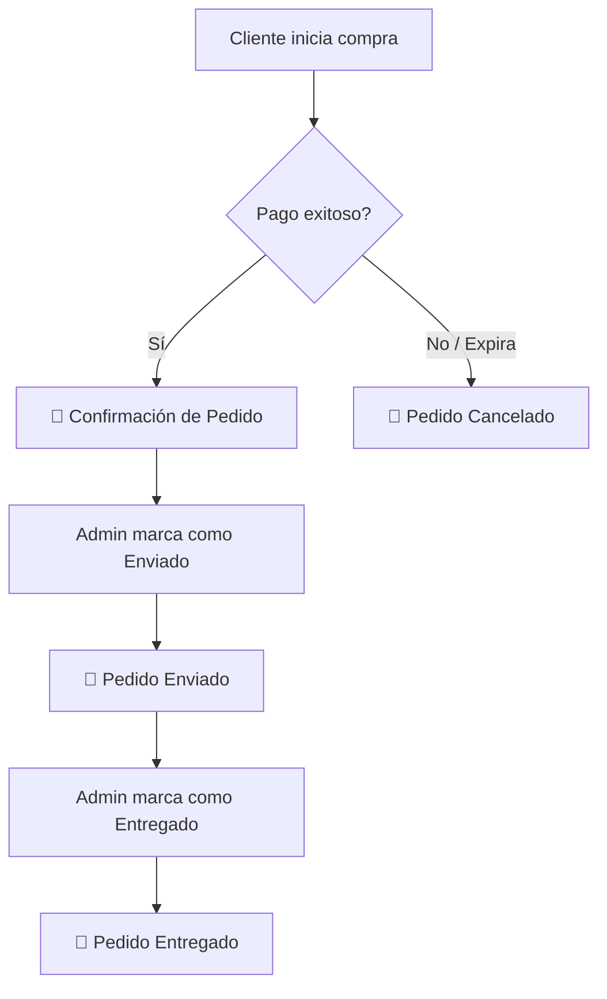
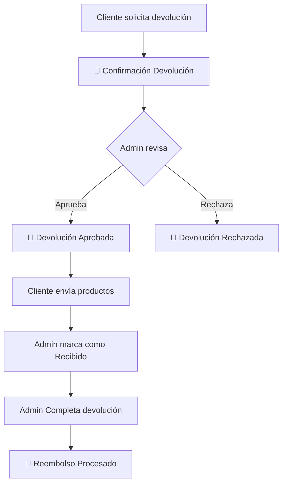

# 📧 Flujos de Correos Electrónicos - FashionStore

Este documento describe todos los correos que se envían en el sistema, cuándo se envían y quién los recibe.

---

## 🛒 Ciclo de Compra

---

## 📦 Correos de Pedidos

### 1. Confirmación de Pedido ✓

| Campo            | Valor                                                         |
| ---------------- | ------------------------------------------------------------- |
| **Trigger**      | Pago completado (webhook Stripe `checkout.session.completed`) |
| **Archivo**      | `webhooks/stripe.ts` → `sendOrderConfirmation()`              |
| **Destinatario** | Cliente                                                       |
| **Adjuntos**     | PDF del ticket                                                |
| **Subject**      | `✓ Pedido confirmado #A000001 - FashionStore`                 |

---

### 2. Pedido Enviado 🚚

| Campo            | Valor                                                    |
| ---------------- | -------------------------------------------------------- |
| **Trigger**      | Admin cambia estado a `shipped`                          |
| **Archivo**      | `admin/pedidos.ts` → `sendOrderShipped()`                |
| **Destinatario** | Cliente                                                  |
| **Subject**      | `🚚 ¡Tu pedido #A000001 ha sido enviado! - FashionStore` |

---

### 3. Pedido Entregado ✅ **(NUEVO)**

| Campo            | Valor                                           |
| ---------------- | ----------------------------------------------- |
| **Trigger**      | Admin cambia estado a `delivered`               |
| **Archivo**      | `admin/pedidos.ts` → `sendOrderDelivered()`     |
| **Destinatario** | Cliente                                         |
| **Subject**      | `✅ ¡Pedido #A000001 entregado! - FashionStore` |

---

### 4. Pedido Cancelado ❌ **(NUEVO)**

| Campo            | Valor                                                              |
| ---------------- | ------------------------------------------------------------------ |
| **Trigger**      | Sesión Stripe expira O Admin cancela pedido                        |
| **Archivo**      | `webhooks/stripe.ts` + `admin/pedidos.ts` → `sendOrderCancelled()` |
| **Destinatario** | Cliente                                                            |
| **Subject**      | `❌ Pedido #A000001 cancelado - FashionStore`                      |

---

## 📦↩️ Ciclo de Devoluciones

---

## 📦↩️ Correos de Devoluciones

### 5. Confirmación de Devolución 📦

| Campo            | Valor                                              |
| ---------------- | -------------------------------------------------- |
| **Trigger**      | Cliente solicita devolución                        |
| **Archivo**      | `api/returns.ts` → `sendReturnConfirmation()`      |
| **Destinatario** | Cliente                                            |
| **Subject**      | `📦 Devolución #XXXXXXXX - Instrucciones de envío` |

---

### 6. Devolución Aprobada ✅ **(NUEVO)**

| Campo            | Valor                                                     |
| ---------------- | --------------------------------------------------------- |
| **Trigger**      | Admin ejecuta acción `approve`                            |
| **Archivo**      | `admin/returns.ts` → `sendReturnApproved()`               |
| **Destinatario** | Cliente                                                   |
| **Subject**      | `✅ Devolución aprobada - Pedido #A000001 - FashionStore` |

---

### 7. Devolución Rechazada ⚠️ **(NUEVO)**

| Campo            | Valor                                                                   |
| ---------------- | ----------------------------------------------------------------------- |
| **Trigger**      | Admin ejecuta acción `reject`                                           |
| **Archivo**      | `admin/returns.ts` → `sendReturnRejected()`                             |
| **Destinatario** | Cliente                                                                 |
| **Subject**      | `⚠️ Actualización sobre tu devolución - Pedido #A000001 - FashionStore` |

---

### 8. Reembolso Procesado 💰 **(NUEVO)**

| Campo            | Valor                                                     |
| ---------------- | --------------------------------------------------------- |
| **Trigger**      | Admin ejecuta acción `complete`                           |
| **Archivo**      | `admin/returns.ts` → `sendRefundProcessed()`              |
| **Destinatario** | Cliente                                                   |
| **Subject**      | `💰 Reembolso procesado - Pedido #A000001 - FashionStore` |

---

## 📰 Newsletter

### 9. Bienvenida 👋

| Campo            | Valor                                             |
| ---------------- | ------------------------------------------------- |
| **Trigger**      | Cliente se suscribe o reactiva suscripción        |
| **Archivo**      | `newsletter/subscribe.ts` → `sendWelcomeEmail()`  |
| **Destinatario** | Suscriptor                                        |
| **Subject**      | `¡Bienvenido a la newsletter de FashionStore! 🎉` |

---

### 10. Campaña Newsletter 📰

| Campo            | Valor                           |
| ---------------- | ------------------------------- |
| **Trigger**      | Admin envía campaña desde panel |
| **Archivo**      | `admin/newsletter/send.ts`      |
| **Destinatario** | Lista de suscriptores activos   |
| **Subject**      | Personalizado por campaña       |

---

## 📁 Archivos Modificados

| Archivo                            | Cambios                                                                              |
| ---------------------------------- | ------------------------------------------------------------------------------------ |
| `src/lib/email-templates.ts`       | +5 templates (Delivered, Cancelled, ReturnApproved, ReturnRejected, RefundProcessed) |
| `src/lib/email.ts`                 | +5 funciones de envío                                                                |
| `src/pages/api/admin/pedidos.ts`   | +triggers para delivered y cancelled                                                 |
| `src/pages/api/admin/returns.ts`   | +triggers para approve, reject, complete                                             |
| `src/pages/api/webhooks/stripe.ts` | +trigger para checkout.session.expired                                               |

---

## ✅ Resumen de Implementación

| #   | Correo                  | Estado        | Trigger                       |
| --- | ----------------------- | ------------- | ----------------------------- |
| 1   | Confirmación Pedido     | ✅ Ya existía | Pago completado               |
| 2   | Pedido Enviado          | ✅ Ya existía | Estado → shipped              |
| 3   | Pedido Entregado        | ✅ **NUEVO**  | Estado → delivered            |
| 4   | Pedido Cancelado        | ✅ **NUEVO**  | Sesión expira / Admin cancela |
| 5   | Confirmación Devolución | ✅ Ya existía | Cliente solicita              |
| 6   | Devolución Aprobada     | ✅ **NUEVO**  | Acción approve                |
| 7   | Devolución Rechazada    | ✅ **NUEVO**  | Acción reject                 |
| 8   | Reembolso Procesado     | ✅ **NUEVO**  | Acción complete               |
| 9   | Newsletter Bienvenida   | ✅ Ya existía | Suscripción                   |
| 10  | Newsletter Campaña      | ✅ Ya existía | Admin envía                   |
